<p align="center">
  
  
  
  
  
</p>

<p align="center">
  <b>The first OpenEnv-compliant benchmark for evaluating AI agents on real-world production incident response.</b>
</p>

# SREBench — On-Call Incident Response Benchmark

**SREBench** is a fully deterministic, OpenEnv-compliant reinforcement learning environment that simulates real-world production incident response for SRE/DevOps AI agents. It challenges LLM-based agents to investigate production alerts, trace service dependencies across an 8-service microservice architecture, diagnose root causes, apply targeted fixes, verify resolution, and write detailed postmortems — mirroring the complete lifecycle of a real on-call engineer.

> **Team: Quant Quasars**
>
> Rahul Ashok · Pritham Devaprasad · Siddarth S

---

## Live Deployment

| Resource | Link |
|---|---|
| **HuggingFace Space** | [neuralninja110/srebench](https://huggingface.co/spaces/neuralninja110/srebench) |
| **Live API** | `https://neuralninja110-srebench.hf.space` |
| **Health Check** | [/health](https://neuralninja110-srebench.hf.space/health) |

---

## Table of Contents

- [Overview](#overview)
- [System Architecture](#system-architecture)
- [Service Topology](#service-topology)
- [Task Catalog (16 Tasks)](#task-catalog-16-tasks)
- [Investigation Gating & Evidence System](#investigation-gating--evidence-system)
- [Novel Mechanics](#novel-mechanics)
- [Agent-Environment Interaction](#agent-environment-interaction)
- [Action Space (15 Actions)](#action-space-15-actions)
- [Observation Space](#observation-space)
- [Reward System](#reward-system)
- [Baseline Scores](#baseline-scores)
- [Quick Start](#quick-start)
- [Inference Script](#inference-script)
- [API Reference](#api-reference)
- [Project Structure](#project-structure)
- [Testing & Validation](#testing--validation)
- [Team](#team)

---

## Overview

SREBench fills a critical gap in AI evaluation: **there are no standardized benchmarks for testing whether LLMs can handle real production incidents**. Traditional coding benchmarks (SWE-Bench, HumanEval) test function-level code generation, but SRE work requires multi-step investigation, dependency-aware reasoning, and sequential decision-making under time pressure and uncertainty.

### Core Capabilities Evaluated

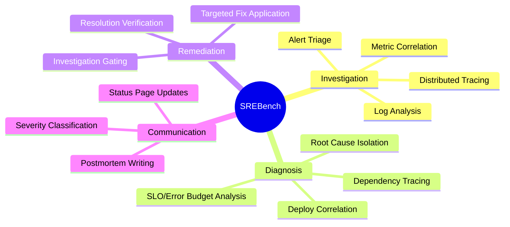

| Capability | Description |
|---|---|
| **Alert Triage** | Interpret production alerts, prioritize investigation across 8 services |
| **Log Analysis** | Parse realistic application logs with embedded causal markers |
| **Distributed Tracing** | Analyze request spans across service boundaries with latency/error data |
| **Dependency Tracing** | Navigate the service DAG to isolate root causes at leaf nodes |
| **Metric Correlation** | Cross-reference error rates, latencies, memory, CPU, and disk usage |
| **Deploy Correlation** | Match incident timelines with deployment history and config diffs |
| **SLO/Error Budget** | Monitor real-time SLO burn rates and budget exhaustion |
| **Targeted Remediation** | Apply the correct fix to the correct service (gated by evidence) |
| **Incident Communication** | Classify severity (SEV1–SEV4), update status pages |
| **Postmortem Writing** | Document root cause, timeline, impact, and action items |

### OpenEnv Integration

SREBench extends the official OpenEnv SDK base classes with full type safety:

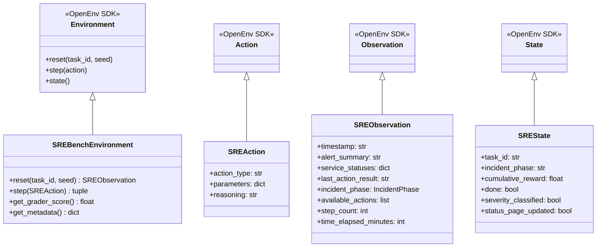

Standard OpenEnv endpoints (`/reset`, `/step`, `/state`, `/schema`, `/ws`, `/health`) are auto-generated via `create_app()`, with custom SRE endpoints (`/tasks`, `/grader`, `/baseline`) layered on top.

### torchforge GRPO Training

SREBench works out-of-the-box with torchforge's Group Relative Policy Optimization:
```bash
torchforge grpo --config examples/torchforge_grpo/config.yaml --env-url ws://localhost:7860
```
See [`examples/torchforge_grpo/`](examples/torchforge_grpo/) for full training config.

---

## System Architecture

### High-Level Component Architecture

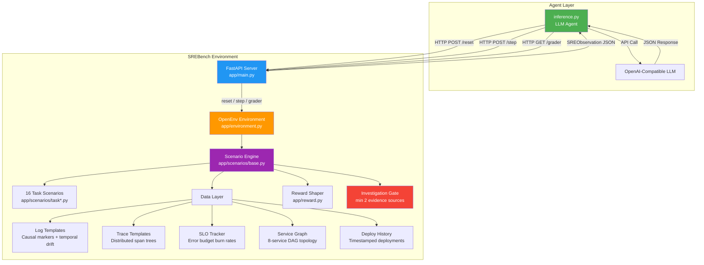

### Request-Response Lifecycle

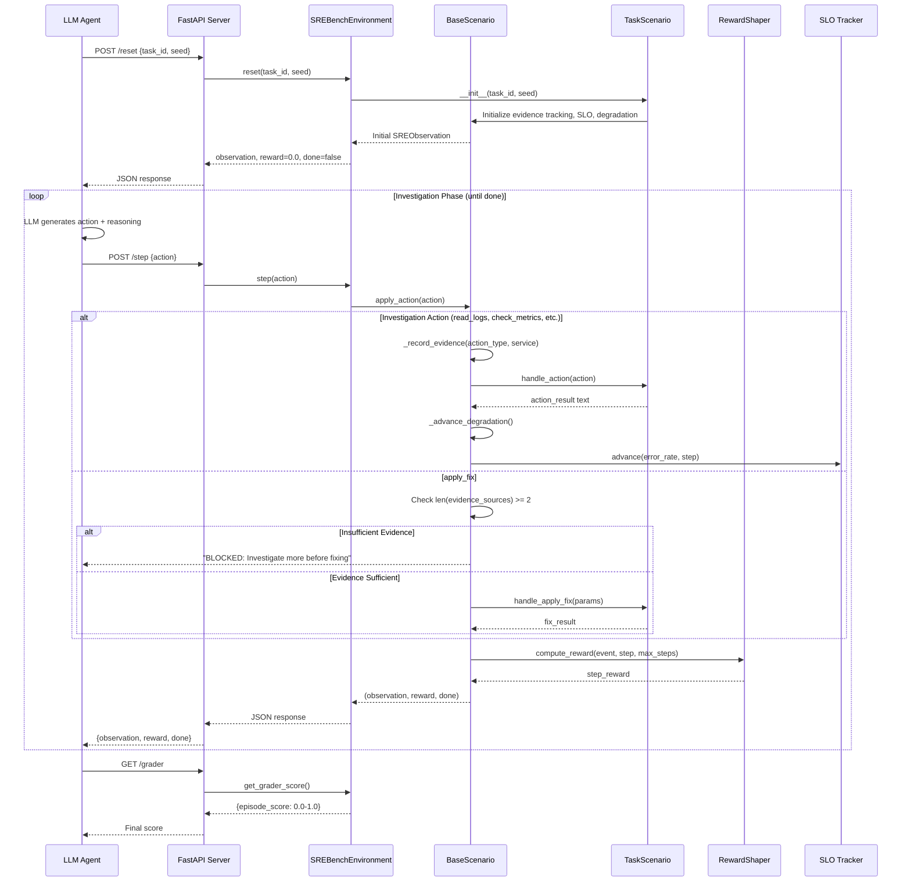

---

## Service Topology

SREBench models an **8-service e-commerce microservice architecture** with realistic dependency chains where errors cascade from leaf services to the gateway.

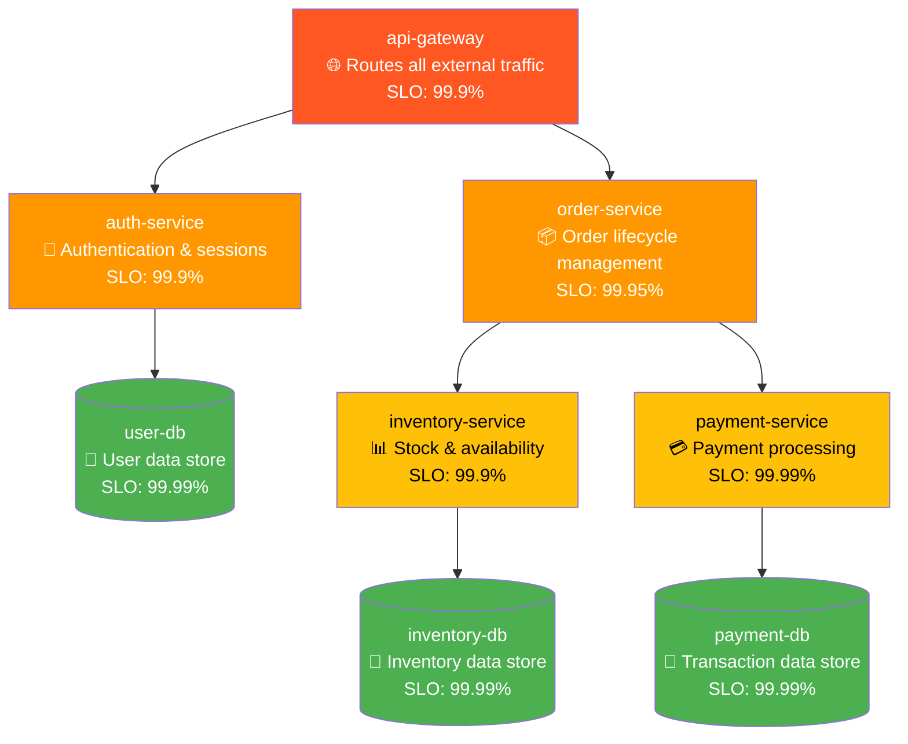

| Service | Type | Role | Default SLO |
|---|---|---|---|
| `api-gateway` | Gateway | Routes all external traffic, rate limiting | 99.9% |
| `auth-service` | Service | Authentication, session management | 99.9% |
| `order-service` | Service | Order lifecycle, Kafka consumers | 99.95% |
| `inventory-service` | Service | Stock management, Redis cache | 99.9% |
| `payment-service` | Service | Payment processing, external API | 99.99% |
| `user-db` | Database | User data store | 99.99% |
| `inventory-db` | Database | Inventory data store | 99.99% |
| `payment-db` | Database | Payment/transaction data store | 99.99% |

### Error Cascade Pattern

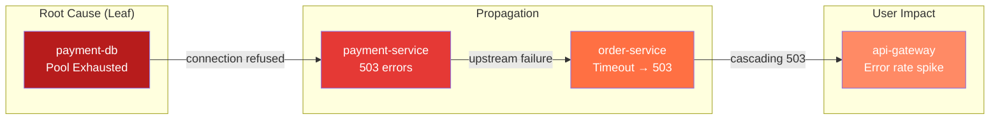

Errors propagate **upstream** through the dependency chain. The agent must trace **downstream** from symptoms at the gateway to isolate the root cause at a leaf node.

---

## Task Catalog (16 Tasks)

SREBench includes **16 production incident scenarios** spanning easy to hard difficulty, each testing different SRE competencies:

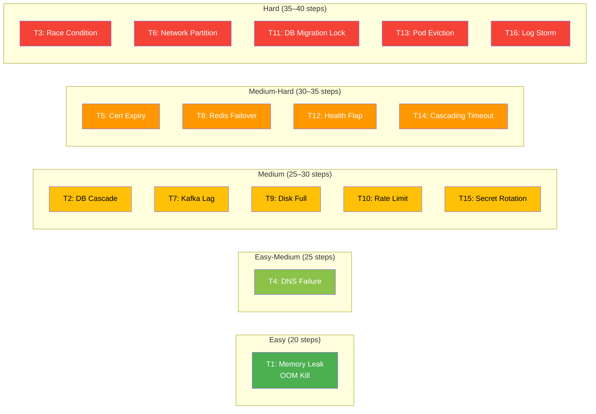

### Detailed Task Breakdown

| # | Task | Difficulty | Steps | Root Cause | Affected Service | Fix Type |
|---|---|---|---|---|---|---|
| 1 | **Memory Leak OOM Kill** | Easy | 20 | Memory leak causing repeated OOM kills | `order-service` | `restart_service` |
| 2 | **Cascading DB Pool Exhaustion** | Medium | 30 | Connection pool exhausted, cascading upstream | `payment-db` | `increase_pool_size` |
| 3 | **Distributed Race Condition** | Hard | 40 | Config deploy changed Redis lock params | `inventory-service` | `rollback` with deploy_id |
| 4 | **DNS Resolution Failure** | Easy-Medium | 25 | Stale DNS cache, NXDOMAIN for user-db | `auth-service` | `flush_dns` |
| 5 | **TLS Certificate Expiry Chain** | Medium-Hard | 35 | SSL cert expired, handshake failures | `payment-service` | `renew_cert` |
| 6 | **Split-Brain Network Partition** | Hard | 40 | iptables misconfiguration, stale data | `inventory-service` | `rollback_deploy` + `reconcile_data` |
| 7 | **Kafka Consumer Lag Storm** | Medium | 25 | Deploy changed session.timeout.ms (30s→3s) | `order-service` | `rollback` deploy |
| 8 | **Redis Sentinel Failover Failure** | Medium-Hard | 30 | Sentinel quorum broken, cache miss storm | `inventory-service` | `force_failover` or fix quorum |
| 9 | **Database Disk Space Exhaustion** | Medium | 25 | WAL log accumulation, disk 100% full | `user-db` | `clean_wal` + re-enable rotation |
| 10 | **Rate Limiter Misconfiguration** | Medium | 25 | Rate limit set to 100 instead of 10000 req/s | `api-gateway` | `rollback` config deploy |
| 11 | **Database Migration Table Lock** | Hard | 35 | ALTER TABLE without lock_timeout during peak | `payment-db` | `kill_query` |
| 12 | **Load Balancer Health Check Flapping** | Medium-Hard | 30 | Deep health check calls slow dependency | `order-service` | `switch_health_check` to shallow |
| 13 | **Kubernetes Pod Eviction Storm** | Hard | 35 | Noisy neighbor DaemonSet without limits | `payment-service` | `remove_daemonset` or add limits |
| 14 | **Cascading Timeout Chain** | Medium-Hard | 30 | Missing DB index → 25s queries → timeout mismatch | `inventory-service` | `create_index` |
| 15 | **Secret Rotation Failure** | Medium | 25 | API key rotated in Vault, service not restarted | `payment-service` | `restart_service` to reload key |
| 16 | **Debug Log Storm Pipeline Saturation** | Hard | 35 | LOG_LEVEL=DEBUG in prod, 50GB/hr log volume | `auth-service` | `rollback` log level deploy |

### Task Domain Coverage

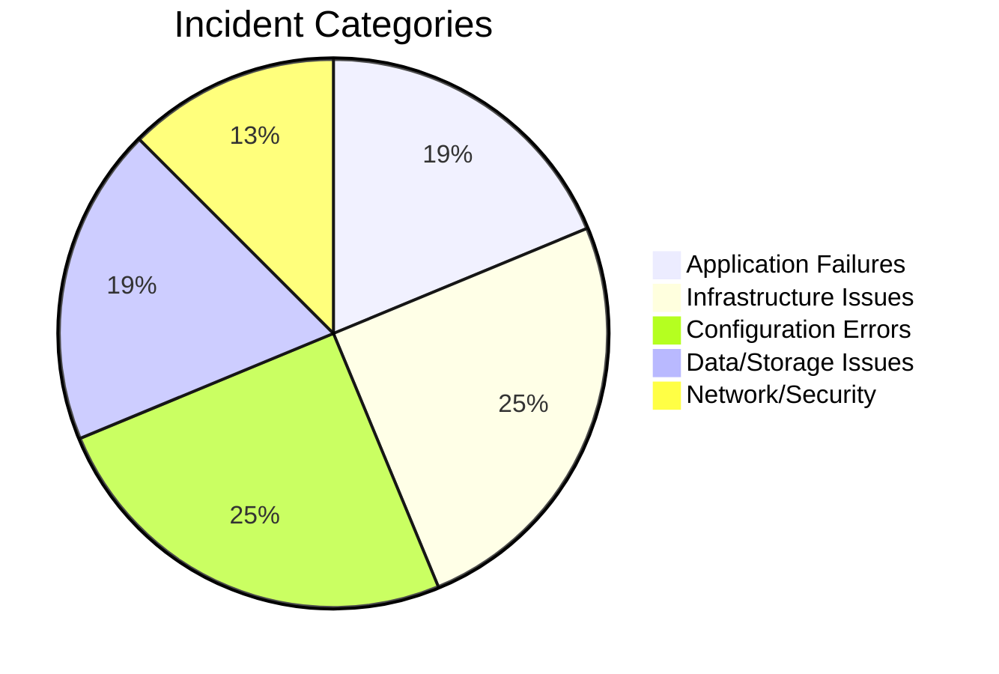

---

## Investigation Gating & Evidence System

SREBench enforces **investigation before remediation**. Agents cannot blindly apply fixes — they must first gather evidence from at least **2 distinct sources**.

### Evidence Gating Flow

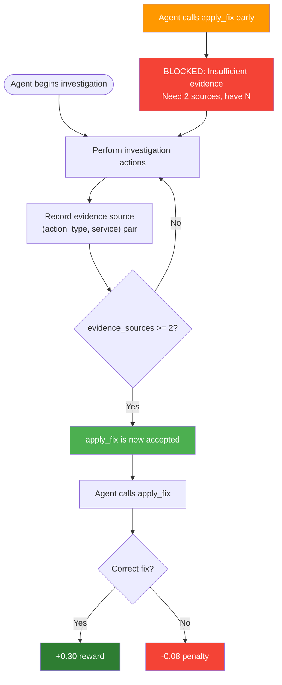

### Evidence Breadth Scoring

The environment tracks distinct `(action_type, service)` pairs to reward investigative breadth:

| Evidence Sources | Breadth Bonus |
|---|---|
| 0 | +0.00 |
| 1 | +0.02 |
| 2 | +0.04 |
| 3 | +0.06 |
| 4+ | +0.08 (max) |

This prevents agents from gaming the system by narrowly investigating a single data source. Broad investigation across logs, metrics, traces, and dependencies is explicitly rewarded.

---

## Novel Mechanics

SREBench implements 8 novel mechanics not found in existing RL benchmarks:

### 1. Cascading Degradation

Unresolved incidents **get progressively worse** over time. Each step that passes without a fix increases error rates (+0.02/step) and latencies (×1.04/step) across affected services, up to a 30% degradation cap.

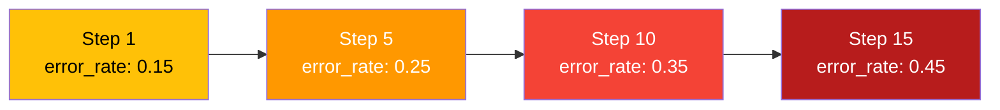

### 2. Red-Herring Alert Injection

Between steps 3 and `max_steps/3`, the environment randomly injects **misleading alerts** (e.g., CPU spikes on unrelated services). This tests whether agents can maintain focus on the actual root cause versus chasing noise.

### 3. Distributed Tracing

The `trace_request` action returns **realistic span trees** with parent-child relationships, per-span latencies, status codes, and semantic tags. Traces are seeded and vary by `step_count` for temporal realism.

```
TRACE: req-abc123 (api-gateway → order-service → payment-service → payment-db)
┌──────────────────┬────────────────────┬──────────┬────────┬──────────────────────┐
│ Service          │ Operation          │ Duration │ Status │ Tags                 │
├──────────────────┼────────────────────┼──────────┼────────┼──────────────────────┤
│ api-gateway      │ route_request      │    45ms  │   ok   │                      │
│ order-service    │ process_order      │  8500ms  │  error │ timeout=true         │
│ payment-service  │ charge_card        │ 30200ms  │  error │ pool_wait=29800ms    │
│ payment-db       │ connection_acquire │ 30000ms  │  error │ pool_active=198/200  │
└──────────────────┴────────────────────┴──────────┴────────┴──────────────────────┘
⚠ ANOMALY: payment-db connection_acquire 30000ms (threshold: 5000ms)
```

### 4. SLO/Error Budget Tracking

Each service has a defined SLO target. The environment tracks **real-time error budget consumption** based on actual error rates:

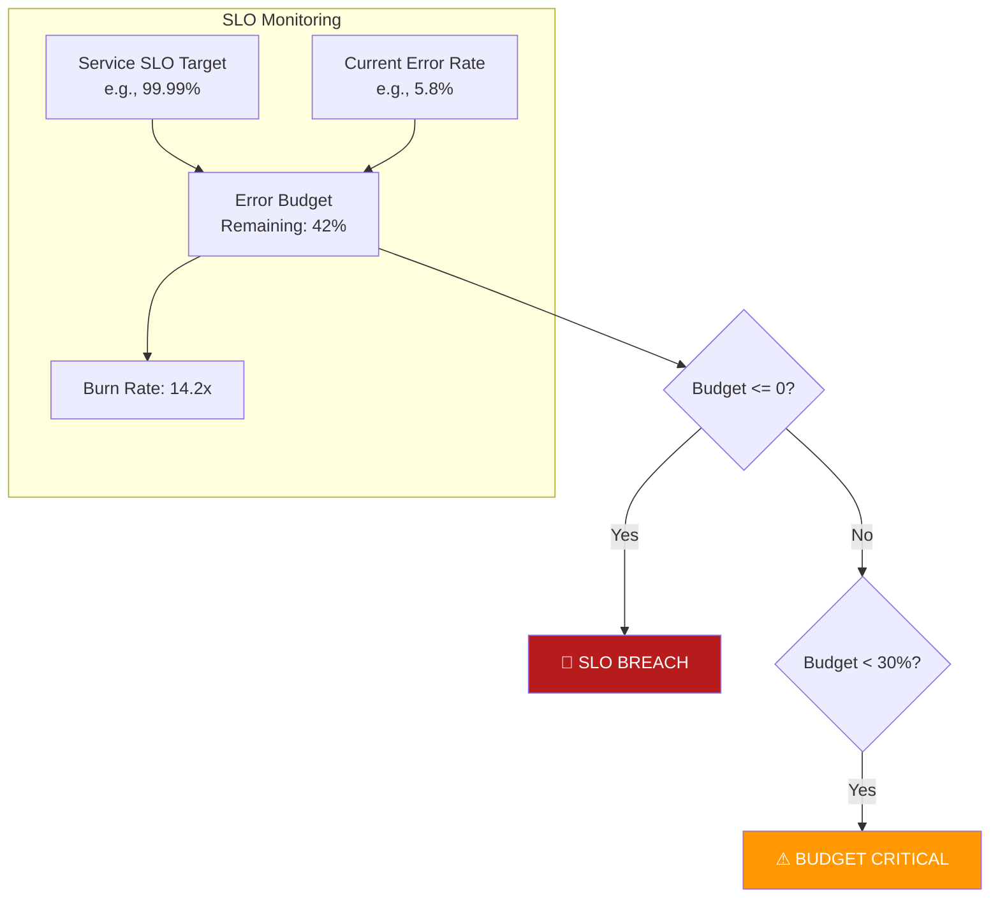

### 5. Incident Communication

Agents can classify incident severity (`SEV1`–`SEV4`) and update status pages throughout the investigation. Communication *before* fix application is scored as a bonus:

| Severity | Criteria |
|---|---|
| **SEV1** | Multiple services down, user-facing impact |
| **SEV2** | Single critical service down |
| **SEV3** | Degraded performance, partial impact |
| **SEV4** | Minor issue, no user impact |

### 6. Postmortem Quality Scoring

Postmortems are scored based on **content quality** (0.0–0.06 bonus), not just presence. The scorer checks for keywords related to:
- Root cause analysis
- Timeline documentation
- Impact assessment
- Fix description
- Prevention/action items

### 7. Information Decay

Querying the same service 3+ times yields diminishing returns (`+0.005` instead of `+0.02`). This incentivizes **breadth-first investigation** across multiple services rather than repeatedly drilling into one.

### 8. Urgency-Scaled Step Penalties

The per-step penalty increases linearly from `-0.003` (step 1) to `-0.015` (final step), creating increasing time pressure as the incident drags on.

---

## Agent-Environment Interaction

### Incident Phase State Machine

```mermaid
stateDiagram-v2
    [*] --> Investigating: POST /reset

    state Investigating {
        [*] --> Orient
        Orient --> Assess: list_services, check_alerts
        Assess --> Communicate: check_slo, classify_severity
        Communicate --> Gather: update_status_page
        Gather --> Trace: read_logs, check_metrics
        Trace --> Correlate: trace_request, check_dependencies
        Correlate --> Diagnose: check_deployments, run_diagnostic
        Diagnose --> [*]
    }

    Investigating --> Mitigating: Evidence gathered (>=2 sources)

    state Mitigating {
        [*] --> ApplyFix: apply_fix
        ApplyFix --> [*]
    }

    Mitigating --> Verifying: Fix applied

    state Verifying {
        [*] --> VerifyHealth: verify_health
        VerifyHealth --> [*]
    }

    Verifying --> Resolved: Health confirmed

    state Resolved {
        [*] --> UpdateStatus: update_status_page (resolved)
        UpdateStatus --> WritePostmortem: write_postmortem
        WritePostmortem --> [*]
    }

    Resolved --> [*]: Episode complete (done=true)
```

### Recommended 12-Step Investigation Methodology

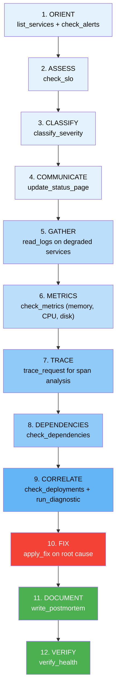

---

## Action Space (15 Actions)

| Action | Parameters | Phase | Purpose |
|---|---|---|---|
| `list_services` | `{}` | Investigating | List all services with health status |
| `check_alerts` | `{}` | Investigating | View active production alerts |
| `read_logs` | `{service, severity?, lines?}` | Investigating | Application logs with causal markers |
| `check_metrics` | `{service, metric_type}` | Investigating | Service metrics (error_rate, latency, memory, cpu, disk) |
| `check_deployments` | `{service?}` or `{last_n?}` | Investigating | Recent deployment history with timestamps |
| `check_dependencies` | `{service}` | Investigating | Service dependency graph (upstream/downstream) |
| `run_diagnostic` | `{service, type}` | Investigating | Targeted diagnostic (memory, dns, tls, iptables, config_diff, db_pool) |
| `trace_request` | `{service}` | Investigating | Distributed trace with span tree and latencies |
| `check_slo` | `{}` | Investigating | SLO status and error budget for all services |
| `classify_severity` | `{severity}` | Investigating | Classify incident as SEV1–SEV4 |
| `update_status_page` | `{status, message}` | Any | Update incident status page (investigating/identified/monitoring/resolved) |
| `apply_fix` | `{service, fix_type, ...}` | Mitigating | Apply remediation **(requires ≥2 evidence sources)** |
| `verify_health` | `{service?}` | Verifying | Confirm services recovered after fix |
| `write_postmortem` | `{content}` | Resolved | Document root cause, timeline, and action items |
| `escalate` | `{}` | Any | Request a hint (costs `-0.05` reward) |

---

## Observation Space

Every action returns a rich `SREObservation` JSON:

| Field | Type | Description |
|---|---|---|
| `timestamp` | `string` | Current simulation time (ISO 8601, advances with steps) |
| `alert_summary` | `string` | Description of the active incident + any red-herring alerts |
| `service_statuses` | `dict[str, ServiceStatus]` | Status, error_rate, latency_p99_ms, restarts for all 8 services |
| `last_action_result` | `string` | Detailed text result of the last action (logs, metrics, traces, etc.) |
| `incident_phase` | `enum` | `investigating` → `mitigating` → `verifying` → `resolved` |
| `available_actions` | `list[str]` | All 15 valid action types |
| `step_count` | `int` | Current step number |
| `time_elapsed_minutes` | `int` | Simulated minutes elapsed |
| `hints_used` | `int` | Number of escalations used |
| `step_reward` | `float` | Reward for the last action |
| `cumulative_reward` | `float` | Total accumulated reward |
| `episode_score` | `float` | Running episode score |

### ServiceStatus Schema

```json
{
  "name": "payment-service",
  "status": "down",          // healthy | degraded | down | unknown
  "error_rate": 0.58,        // 0.0 - 1.0
  "latency_p99_ms": 12000,
  "restarts_last_hour": 4
}
```

---

## Reward System

SREBench uses a **dense, shaped reward function** providing signal at every step of the investigation:

### Reward Breakdown

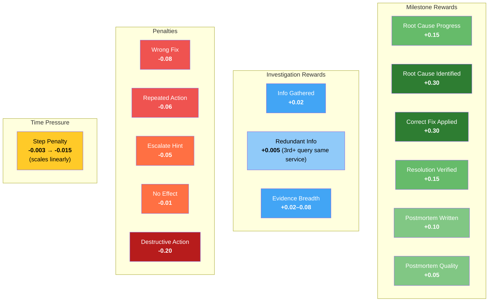

### Scoring Formula

The final episode score (0.0–1.0) incorporates:

| Component | Weight | Description |
|---|---|---|
| Correct fix applied | ~30% | Did the agent fix the right service with the right action? |
| Root cause identification | ~30% | Did the agent identify the actual root cause? |
| Resolution verified | ~15% | Did the agent verify health after fixing? |
| Evidence breadth | up to 8% | How many distinct evidence sources were consulted? |
| Postmortem quality | up to 6% | Was a detailed, keyword-rich postmortem written? |
| Step efficiency | Variable | Fewer steps → less cumulative penalty |
| Penalties deducted | Variable | Wrong fixes, repeated actions, hints reduce score |

### Reward Design Principles

1. **Dense Signal** — every action returns a reward, not just end-of-episode
2. **Time Pressure** — escalating step penalties incentivize efficient investigation
3. **Correct Fix Premium** — `+0.30` for correct fix rewards precise diagnosis
4. **Wrong Fix Penalty** — `-0.08` discourages brute-force trial-and-error
5. **Investigation Breadth** — evidence diversity is explicitly scored
6. **Quality Over Quantity** — redundant queries are penalized; postmortem quality matters

---

## Baseline Scores

Benchmarked across multiple OpenAI models using the same inference pipeline:

| Task | GPT-4o | GPT-5.1 | GPT-5.2 | GPT-5.4 |
|---|---|---|---|---|
| Task 1: Memory Leak | **0.865** | 0.865 | 0.855 | 0.855 |
| Task 2: DB Cascade | **0.890** | 0.737 | 0.882 | 0.735 |
| Task 3: Race Condition | **0.650** | 0.450 | **0.650** | 0.575 |
| Task 4: DNS Failure | 0.790 | **0.938** | **0.938** | 0.930 |
| Task 5: Cert Expiry | 0.693 | 0.693 | 0.693 | **0.886** |
| Task 6: Network Partition | **0.889** | 0.790 | 0.886 | 0.885 |
| **Average** | **0.796** | 0.745 | 0.817 | 0.811 |

> GPT-4o was selected as the default baseline model for its consistently high performance across all difficulty levels.

---

## Quick Start

### Prerequisites

- Python 3.10+
- Docker (for containerized deployment)
- [uv](https://github.com/astral-sh/uv) (recommended) or pip

### Installation

```bash
# Clone the repository
git clone https://github.com/Airocult/Scaler-Meta-Competition-2026.git
cd Scaler-Meta-Competition-2026

# Install dependencies with uv
uv pip install -e ".[baseline,dev]"

# Or with pip
pip install -r requirements.txt
```

### Docker Deployment

```bash
docker build -t srebench .
docker run -p 7860:7860 srebench
# Health check: curl http://localhost:7860/health
```

### Start the Server Locally

```bash
uvicorn app.main:app --host 0.0.0.0 --port 7860
```

### Run the Baseline Agent

```bash
# Set environment variables
export API_BASE_URL="https://api.openai.com/v1"
export MODEL_NAME="gpt-4o"
export HF_TOKEN="sk-..."
export SREBENCH_URL="http://localhost:7860"

python inference.py
```

### Run Against Live HuggingFace Space

```bash
API_BASE_URL="https://api.openai.com/v1" \
MODEL_NAME="gpt-4o" \
HF_TOKEN="sk-..." \
SREBENCH_URL="https://neuralninja110-srebench.hf.space" \
python inference.py
```

### Quick Validation

```bash
# Run pre-submission validator
python validate.py

# Run pytest suite
pytest tests/ -v

# Run full evaluation
python -m eval.run_eval
```

---

## Inference Script

The `inference.py` is the mandatory submission script. It uses the OpenAI client for all LLM calls and emits structured stdout logs.

### Environment Variables

| Variable | Required | Default | Description |
|---|---|---|---|
| `API_BASE_URL` | Yes | `https://api.openai.com/v1` | LLM API endpoint |
| `MODEL_NAME` | Yes | `gpt-4o` | Model identifier |
| `HF_TOKEN` | Yes | — | API key for the LLM |
| `SREBENCH_URL` | No | `https://neuralninja110-srebench.hf.space` | SREBench server URL |
| `LOCAL_IMAGE_NAME` | No | — | Docker image name (for local deployment) |

### Structured Logging Format

The inference script emits logs in the **exact required format** for evaluation:

```
[START] task=task1_memory_leak env=https://neuralninja110-srebench.hf.space model=gpt-4o
[STEP] step=1 action=list_services reward=-0.01 done=false error=
[STEP] step=2 action=read_logs reward=0.02 done=false error=
...
[END] success=true steps=12 score=0.865 rewards=-0.01,0.02,...
```

### System Prompt Architecture

The agent uses a **12-step investigation methodology** with built-in pattern matching:

| Symptom Pattern | Diagnostic Type | Likely Fix |
|---|---|---|
| OOMKilled, heap space, GC pause | `memory` | `restart_service` |
| HikariPool, connection pool exhausted | `db_pool` | `increase_pool_size` |
| SSL handshake, certificate expired | `tls` | `renew_cert` |
| DNS resolution, NXDOMAIN | `dns` | `flush_dns` |
| Network unreachable, iptables | `iptables` | `rollback_deploy` |
| Error spike + recent deploy | `config_diff` | `rollback` |
| Consumer lag, rebalance loop | `config_diff` | `rollback` |
| Disk full, ENOSPC, WAL | `disk` | `clean_wal` |
| 429 Too Many Requests | `config_diff` | `rollback` |
| ALTER TABLE, exclusive lock | `db_pool` | `kill_query` |

### Context Window Management

For long investigations (20+ messages):
- Old actions are compressed into a summary
- Services investigated are tracked
- Hypothesis context is preserved
- The most recent 14 messages are kept for continuity

---

## API Reference

### OpenEnv Standard Endpoints

| Endpoint | Method | Description |
|---|---|---|
| `/reset` | `POST` | Reset environment. Body: `{"task_id": "...", "seed": 42}` |
| `/step` | `POST` | Execute an action. Body: `{"action": {"action_type": "...", "parameters": {...}, "reasoning": "..."}}` |
| `/state` | `GET` | Get current environment state |
| `/schema` | `GET` | JSON schemas for action/observation types |
| `/metadata` | `GET` | Environment metadata |
| `/health` | `GET` | Health check → `{"status": "healthy"}` |
| `/ws` | `WebSocket` | Persistent session for RL training loops |

### SREBench Custom Endpoints

| Endpoint | Method | Description |
|---|---|---|
| `/tasks` | `GET` | List all 16 tasks with descriptions and schemas |
| `/grader` | `GET` | Get current episode score `{"episode_score": 0.0–1.0}` |
| `/baseline` | `POST` | Trigger baseline run |

### Example: Full Investigation Flow

```bash
# 1. Reset environment
curl -X POST http://localhost:7860/reset \
  -H "Content-Type: application/json" \
  -d '{"task_id": "task1_memory_leak", "seed": 42}'

# 2. Investigate (builds evidence)
curl -X POST http://localhost:7860/step \
  -H "Content-Type: application/json" \
  -d '{"action": {"action_type": "read_logs", "parameters": {"service": "order-service"}, "reasoning": "Checking logs for OOM patterns"}}'

curl -X POST http://localhost:7860/step \
  -H "Content-Type: application/json" \
  -d '{"action": {"action_type": "check_metrics", "parameters": {"service": "order-service", "metric_type": "memory"}, "reasoning": "Confirming memory growth pattern"}}'

# 3. Apply fix (now allowed — 2 evidence sources gathered)
curl -X POST http://localhost:7860/step \
  -H "Content-Type: application/json" \
  -d '{"action": {"action_type": "apply_fix", "parameters": {"service": "order-service", "fix_type": "restart_service"}, "reasoning": "Restarting service to clear memory leak"}}'

# 4. Verify and close
curl -X POST http://localhost:7860/step \
  -H "Content-Type: application/json" \
  -d '{"action": {"action_type": "verify_health", "parameters": {"service": "order-service"}, "reasoning": "Confirming recovery after restart"}}'

# 5. Get final score
curl http://localhost:7860/grader
# → {"episode_score": 0.72}
```

---

## Project Structure

```
Scaler-Meta-Competition-2026/
├── inference.py                          # Mandatory submission script (OpenAI client)
├── openenv.yaml                          # OpenEnv specification (16 tasks, schemas)
├── validate.py                           # Pre-submission validation script
├── Dockerfile                            # Docker deployment (python:3.11-slim, port 7860)
├── requirements.txt                      # Python dependencies
├── pyproject.toml                        # Project configuration
├── uv.lock                               # Lockfile for uv
│
├── app/                                  # Core environment package
│   ├── main.py                           # FastAPI app + OpenEnv create_app()
│   ├── environment.py                    # SREBenchEnvironment (16 tasks, thread-safe)
│   ├── models.py                         # Pydantic v2 models (SREAction, SREObservation, SREState)
│   ├── reward.py                         # Dense reward shaper (urgency scaling, info decay)
│   │
│   ├── scenarios/                        # Scenario implementations (1 per task)
│   │   ├── base.py                       # BaseScenario (evidence gating, SLO, degradation,
│   │   │                                 #   tracing, communication, postmortem scoring)
│   │   ├── task1_memory_leak.py          # Easy: OOM kill
│   │   ├── task2_db_cascade.py           # Medium: DB pool cascade
│   │   ├── task3_race_condition.py       # Hard: Config-triggered race condition
│   │   ├── task4_dns_failure.py          # Easy-Medium: DNS resolution failure
│   │   ├── task5_cert_expiry.py          # Medium-Hard: TLS certificate chain
│   │   ├── task6_network_partition.py    # Hard: iptables split-brain
│   │   ├── task7_kafka_lag.py            # Medium: Kafka consumer lag storm
│   │   ├── task8_redis_failover.py       # Medium-Hard: Redis sentinel failure
│   │   ├── task9_disk_full.py            # Medium: Database disk exhaustion
│   │   ├── task10_rate_limit.py          # Medium: Rate limiter misconfiguration
│   │   ├── task11_db_migration_lock.py   # Hard: ALTER TABLE lock
│   │   ├── task12_health_flap.py         # Medium-Hard: Health check flapping
│   │   ├── task13_pod_eviction.py        # Hard: K8s pod eviction storm
│   │   ├── task14_cascading_timeout.py   # Medium-Hard: Timeout chain
│   │   ├── task15_secret_rotation.py     # Medium: Vault secret rotation
│   │   └── task16_log_storm.py           # Hard: Debug log storm
│   │
│   ├── graders/                          # Episode-level scoring
│   │   ├── base.py
│   │   └── sre_grader.py
│   │
│   └── data/                             # Deterministic data generators
│       ├── log_templates.py              # Realistic log templates with causal markers
│       ├── trace_templates.py            # Distributed tracing span trees (16 scenarios)
│       ├── slo.py                        # SLO targets and error budget tracker
│       ├── metrics.py                    # Service metrics generator
│       ├── service_graph.py              # 8-service DAG topology
│       └── deploy_history.py             # Deployment history with timestamps
│
├── tests/                                # Pytest suite (22 tests)
│   └── test_env.py                       # Unit + integration tests
│
├── eval/                                 # Evaluation framework (90 eval cases)
│   └── run_eval.py                       # Comprehensive scenario evaluation
│
├── baseline/                             # Baseline runners
│   ├── run_baseline.py
│   └── run_openai_baseline.py
│
├── server/                               # Server entry point
│   └── app.py
│
└── examples/                             # Usage examples
    └── torchforge_grpo/                  # GRPO training config
```

---

## Testing & Validation

SREBench includes a comprehensive multi-layer test suite:

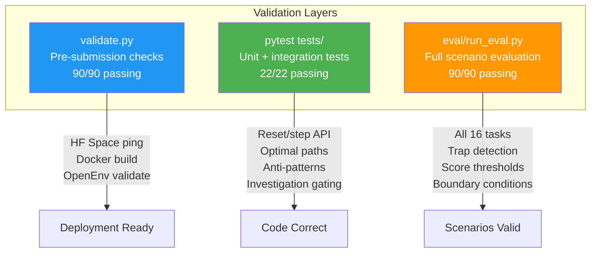

| Validation Layer | Tests | Description |
|---|---|---|
| **Pre-submission validator** (`validate.py`) | 90/90 | HF Space deployment, Docker build, endpoint checks, grader validation |
| **Pytest suite** (`tests/`) | 22/22 | Reset tests, step API, optimal paths, anti-patterns, investigation gating |
| **Evaluation framework** (`eval/`) | 90/90 | All 16 tasks × multiple strategies: optimal, trap, partial, boundary |

### Test Categories

| Category | Coverage |
|---|---|
| **Optimal paths** | Best-case investigation for each task (score ≥ 0.75) |
| **Surface-fix traps** | Agents that skip investigation (score ≤ 0.35) |
| **Wrong service detection** | Fix applied to incorrect service (penalty verified) |
| **Repeated action detection** | Same action repeated (penalty applied) |
| **Investigation gating** | Fix blocked without sufficient evidence |
| **Postmortem quality** | Detailed vs. empty postmortems (scoring difference verified) |
| **Escalation penalties** | Hint usage cost verified |
| **Max step boundaries** | Episode terminates correctly at step limit |

### Run All Tests

```bash
# Pre-submission validation
python validate.py

# Unit and integration tests
pytest tests/ -v

# Full evaluation suite
python -m eval.run_eval
```

---

## Team

### Team Quant Quasars

| Member | Role |
|---|---|
| **Rahul Ashok** 
| **Pritham Devaprasad** 
| **Siddarth S** 

---

## 📄 License

MIT License — see [LICENSE](LICENSE) for details.

---