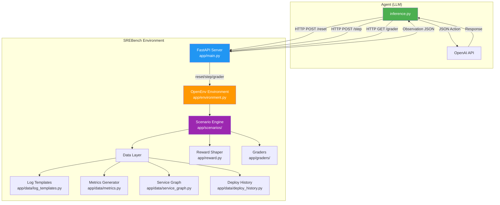
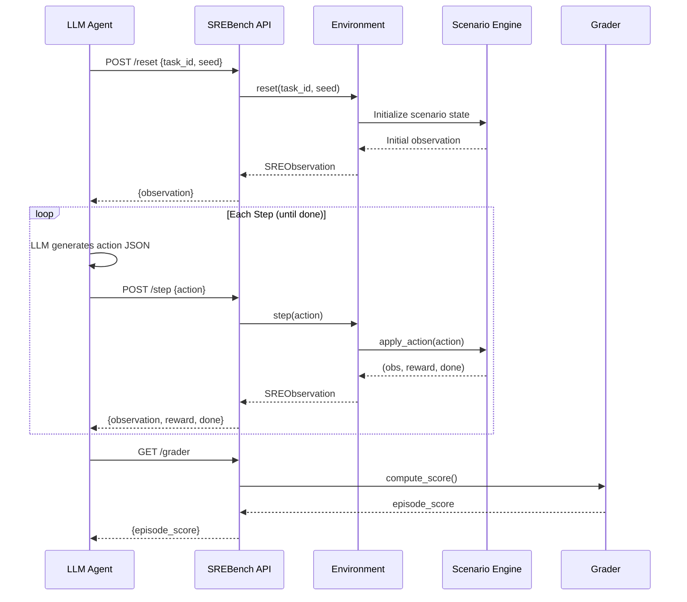
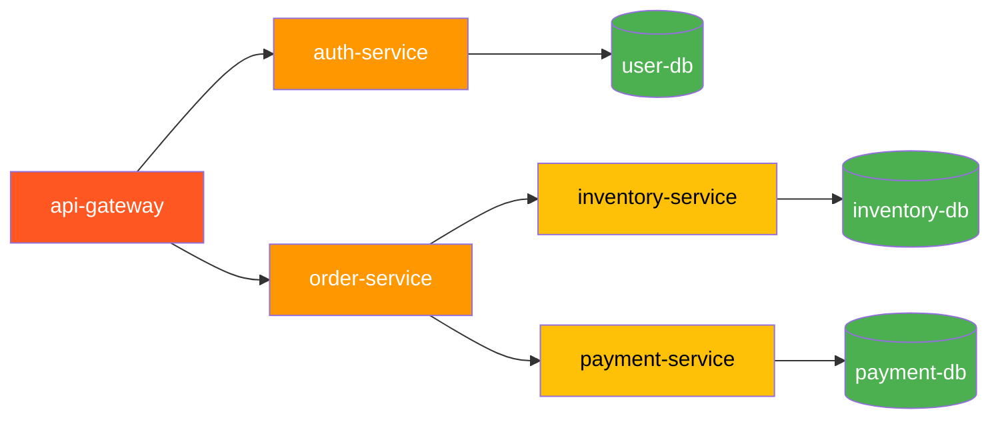
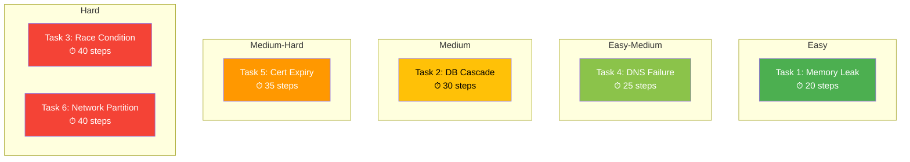
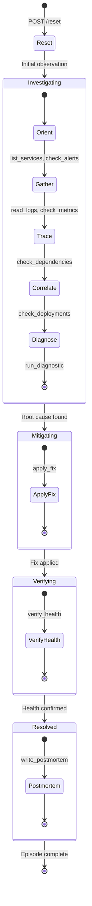
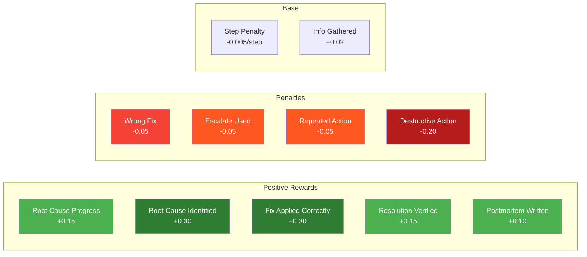

<p align="center">
  
  
  
  
</p>

# 🚨 SREBench — On-Call Incident Response Benchmark

**SREBench** is a fully deterministic, OpenEnv-compliant benchmark that simulates real-world production incident response for SRE/DevOps AI agents. It challenges LLM-based agents to investigate alerts, trace service dependencies, diagnose root causes across an 8-service microservice architecture, apply targeted fixes, and write detailed postmortems — just like a real on-call engineer.

> **Team: Quant Quasars**
>
> Rahul Ashok · Pritham Devaprasad · Siddarth S

---

## 🌐 Live Deployment

| Resource | Link |
|---|---|
| **HuggingFace Space** | [neuralninja110/srebench](https://huggingface.co/spaces/neuralninja110/srebench) |
| **Live API** | `https://neuralninja110-srebench.hf.space` |
| **Health Check** | [/health](https://neuralninja110-srebench.hf.space/health) |

---

## 📋 Table of Contents

- [Overview](#-overview)
- [Architecture](#-architecture)
- [Service Topology](#-service-topology)
- [Task Catalog](#-task-catalog)
- [How It Works](#-how-it-works)
- [Reward System](#-reward-system)
- [Baseline Scores](#-baseline-scores)
- [Quick Start](#-quick-start)
- [Inference Script](#-inference-script)
- [API Reference](#-api-reference)
- [Project Structure](#-project-structure)
- [What Makes SREBench Novel](#-what-makes-srebench-novel)
- [Testing & Validation](#-testing--validation)
- [Team](#-team)

---

## 🔍 Overview

SREBench fills a critical gap in AI evaluation: **there are no standardized benchmarks for testing whether LLMs can handle real production incidents**. Traditional coding benchmarks test function-level code generation, but SRE work requires multi-step investigation, dependency-aware reasoning, and sequential decision-making under uncertainty.

### Key Capabilities Tested

| Capability | Description |
|---|---|
| **Alert Triage** | Interpret production alerts and prioritize investigation |
| **Log Analysis** | Parse realistic application logs with causal markers |
| **Dependency Tracing** | Navigate 8-service DAG to find root causes upstream |
| **Metric Correlation** | Cross-reference error rates, latencies, and resource usage |
| **Deploy Correlation** | Match incident timelines with deployment history |
| **Targeted Remediation** | Apply the correct fix to the correct service |
| **Verification** | Confirm resolution before closing |
| **Postmortem Writing** | Document root cause, timeline, and action items |

### OpenEnv Integration

SREBench extends the official OpenEnv SDK base classes:
- **`SREAction(Action)`** — 11 SRE action types with parameters and reasoning
- **`SREObservation(Observation)`** — Rich incident state with service topology
- **`SREState(State)`** — Full environment state for checkpointing
- **`SREBenchEnvironment(Environment)`** — Gym-style `reset()`/`step()` interface

Standard OpenEnv endpoints (`/reset`, `/step`, `/state`, `/schema`, `/ws`, `/health`) are
auto-generated via `create_app()`, with custom SRE endpoints (`/tasks`, `/grader`, `/baseline`)
layered on top.

### torchforge GRPO Training

SREBench works out-of-the-box with torchforge's Group Relative Policy Optimization:
```bash
torchforge grpo --config examples/torchforge_grpo/config.yaml --env-url ws://localhost:7860
```
See [`examples/torchforge_grpo/`](examples/torchforge_grpo/) for full training config.

---

## 🏗 Architecture



### Request-Response Flow



---

## 🌐 Service Topology

SREBench models an **8-service e-commerce microservice architecture** with realistic dependency chains where errors cascade from leaf services to the gateway.



| Service | Type | Role |
|---|---|---|
| `api-gateway` | Gateway | Routes all external traffic |
| `auth-service` | Service | Handles authentication |
| `order-service` | Service | Manages order lifecycle |
| `inventory-service` | Service | Stock management & availability |
| `payment-service` | Service | Payment processing |
| `user-db` | Database | User data store |
| `inventory-db` | Database | Inventory data store |
| `payment-db` | Database | Payment/transaction data store |

### Cascade Principle

Errors propagate **upstream** through the dependency chain. When `payment-db` exhausts its connection pool, `payment-service` starts failing, which causes `order-service` to return 503s, which degrades `api-gateway`. The agent must trace **downstream** to find the root cause leaf node.

---

## 📚 Task Catalog

SREBench includes **6 carefully designed incident scenarios** spanning easy to hard difficulty, each testing different SRE competencies:



### Task 1: Memory Leak OOM Kill (Easy)
- **Root Cause:** `order-service` has a memory leak causing repeated OOM kills
- **Key Signals:** OOM logs, high memory metrics, container restarts
- **Fix:** `restart` the affected service
- **Skills Tested:** Log reading, metric checking, basic remediation

### Task 2: Cascading DB Pool Exhaustion (Medium)
- **Root Cause:** `payment-db` connection pool exhausted, cascading to upstream services
- **Key Signals:** HikariPool errors, 503s on payment-service, cascade to order-service
- **Fix:** `increase_pool_size` on payment-db
- **Skills Tested:** Dependency tracing, cascade analysis, targeted fix at leaf node

### Task 3: Distributed Race Condition via Config Change (Hard)
- **Root Cause:** A config deploy (`deploy-a1b2c3`) to `inventory-service` changed Redis lock parameters, causing race conditions
- **Key Signals:** Redis lock timeouts, stale reads, config_diff showing changed params
- **Fix:** `rollback` the deploy with `deploy_id`
- **Skills Tested:** Deploy correlation, config diff analysis, precise rollback

### Task 4: DNS Resolution Failure (Easy-Medium)
- **Root Cause:** `auth-service` has stale DNS cache, can't resolve `user-db`
- **Key Signals:** DNS resolution errors, NXDOMAIN in logs, getaddrinfo failures
- **Fix:** `flush_dns` on auth-service
- **Skills Tested:** DNS diagnostics, network troubleshooting

### Task 5: TLS Certificate Expiry Chain (Medium-Hard)
- **Root Cause:** `payment-service` TLS certificate expired, breaking SSL handshakes
- **Key Signals:** SSL handshake failures, certificate expired errors, high latency
- **Fix:** `renew_cert` on payment-service
- **Skills Tested:** TLS diagnostics, certificate chain analysis

### Task 6: Split-Brain Network Partition (Hard)
- **Root Cause:** Misconfigured iptables deploy created partition between `inventory-service` and `inventory-db`
- **Key Signals:** Connection timeouts, network unreachable, stale cached data
- **Fix:** `rollback_deploy` then `reconcile_data`
- **Skills Tested:** Network diagnostics, iptables analysis, data reconciliation

---

## ⚙ How It Works

### Agent-Environment Interaction Loop



### Available Actions (11 total)

| Action | Parameters | Purpose |
|---|---|---|
| `list_services` | `{}` | List all services and their statuses |
| `check_alerts` | `{}` | View active production alerts |
| `read_logs` | `{service}` | Read application logs for a service |
| `check_metrics` | `{service, metric}` | Get service metrics (error_rate, latency, memory, etc.) |
| `check_deployments` | `{service}` or `{last_n}` | View recent deployment history |
| `check_dependencies` | `{service}` | View service dependency graph |
| `run_diagnostic` | `{service, type}` | Run targeted diagnostic (memory, dns, tls, iptables, config_diff, db_pool) |
| `apply_fix` | `{service, fix_type}` | Apply remediation (restart, flush_dns, renew_cert, rollback_deploy, increase_pool_size, reconcile_data) |
| `verify_health` | `{service}` or `{}` | Check if services recovered after fix |
| `write_postmortem` | `{content}` | Document the incident |
| `escalate` | `{}` | Get a hint (costs points) |

### Observation Space

| Field | Type | Description |
|---|---|---|
| `timestamp` | string | Current simulation time (ISO 8601) |
| `alert_summary` | string | Description of the active incident |
| `service_statuses` | dict | Status, error_rate, latency, restarts for all 8 services |
| `last_action_result` | string | Detailed text result of the last action taken |
| `incident_phase` | enum | `investigating` → `mitigating` → `verifying` → `resolved` |
| `available_actions` | list | All valid action types |
| `step_count` | int | Current step number |
| `time_elapsed_minutes` | int | Simulated time elapsed |
| `done` | bool | Whether the episode has terminated (OpenEnv standard) |
| `reward` | float | Step reward signal (OpenEnv standard) |

---

## 💰 Reward System

SREBench uses a **dense, shaped reward function** — not just binary pass/fail at episode end. Every action receives immediate feedback:



### Reward Design Principles

1. **Dense Signal:** Every action returns a reward — agents learn from each step, not just episode outcome
2. **Time Pressure:** `-0.005` per step incentivizes efficient investigation
3. **Correct Fix Premium:** `+0.30` for correct fix rewards precise diagnosis
4. **Wrong Fix Penalty:** `-0.05` discourages trial-and-error approaches
5. **Investigation Bonus:** `+0.15` for progress rewards methodical investigation
6. **Full Episode Score:** Grader computes final `[0, 1]` score incorporating investigation quality, fix correctness, verification, and postmortem

---

## 📊 Baseline Scores

Benchmarked across multiple OpenAI models using the same inference pipeline:

| Task | GPT-4o | GPT-5.1 | GPT-5.2 | GPT-5.4 |
|---|---|---|---|---|
| Task 1: Memory Leak | **0.865** | 0.865 | 0.855 | 0.855 |
| Task 2: DB Cascade | **0.890** | 0.737 | 0.882 | 0.735 |
| Task 3: Race Condition | **0.650** | 0.450 | **0.650** | 0.575 |
| Task 4: DNS Failure | 0.790 | **0.938** | **0.938** | 0.930 |
| Task 5: Cert Expiry | 0.693 | 0.693 | 0.693 | **0.886** |
| Task 6: Network Partition | **0.889** | 0.790 | 0.886 | 0.885 |
| **Average** | **0.796** | 0.745 | 0.817 | 0.811 |

> GPT-4o was selected as the default baseline model for its consistently high performance across all difficulty levels.

---

## 🚀 Quick Start

### Prerequisites

- Python 3.10+
- [uv](https://github.com/astral-sh/uv) (recommended) or pip

### Installation

```bash
# Clone the repository
git clone https://github.com/your-repo/Scaler-Meta-Competition-2026.git
cd Scaler-Meta-Competition-2026

# Install dependencies with uv
uv pip install -e ".[baseline,dev]"

# Or with pip
pip install -e ".[baseline,dev]"
```

### Docker

```bash
docker build -t srebench .
docker run -p 7860:7860 srebench
```

### Start the Server Locally

```bash
uvicorn app.main:app --host 0.0.0.0 --port 7860
```

### Run the Baseline Agent

```bash
# Set your OpenAI key
export OPENAI_API_KEY="sk-..."

# Run against local server
API_BASE_URL="https://api.openai.com/v1" \
MODEL_NAME="gpt-4o" \
HF_TOKEN="$OPENAI_API_KEY" \
SREBENCH_URL="http://localhost:7860" \
python inference.py
```

### Run Against HuggingFace Space

```bash
API_BASE_URL="https://api.openai.com/v1" \
MODEL_NAME="gpt-4o" \
HF_TOKEN="$OPENAI_API_KEY" \
SREBENCH_URL="https://neuralninja110-srebench.hf.space" \
python inference.py
```

### OpenEnv Client (Python)

```python
from client import SREBenchEnv
from app.models import SREAction

async with SREBenchEnv(base_url="ws://localhost:7860") as env:
    result = await env.reset(task_id="task1_memory_leak", seed=42)
    while not result.done:
        action = SREAction(action_type="list_services", reasoning="investigating")
        result = await env.step(action)
```

---

## 🤖 Inference Script

The `inference.py` is the mandatory submission script. Key design features:

### System Prompt Engineering

The agent uses a **structured 7-step investigation methodology**:
1. **ORIENT** — List services + check alerts
2. **GATHER** — Read logs + check metrics on degraded services
3. **TRACE** — Check dependencies, investigate upstream leaf services
4. **CORRELATE** — Check deployments, match timestamps
5. **DIAGNOSE** — Run targeted diagnostics
6. **FIX** — Apply fix to root cause service
7. **VERIFY** — Verify health + write postmortem

### Built-in Pattern Matching

The system prompt includes **pattern matching rules** that map symptoms to diagnostic actions:

| Symptom Pattern | Diagnostic | Fix |
|---|---|---|
| OOMKilled, heap space | `memory` | `restart` |
| HikariPool, connection pool | `db_pool` | `increase_pool_size` |
| SSL handshake, certificate expired | `tls` | `renew_cert` |
| DNS resolution, NXDOMAIN | `dns` | `flush_dns` |
| Network unreachable, iptables | `iptables` | `rollback_deploy` |
| Error spike + deploy correlation | `config_diff` | `rollback` |

### Observation Formatting

`format_observation()` extracts and highlights critical signals:
- **Degraded services** are prominently listed with error rates and latencies
- **Keyword hints** detect TLS/DNS/pool/network patterns and suggest next steps
- **Periodic reminders** prompt the agent to check deployments or write postmortems

### Context Window Management

For long investigations (20+ messages), the script:
- Compresses old actions into a summary
- Tracks services investigated
- Preserves hypothesis context
- Keeps the most recent 14 messages for continuity

### Model Compatibility

The `call_llm()` function handles both standard chat models (`max_tokens`) and reasoning models (`max_completion_tokens`) transparently.

---

## 📡 API Reference

### OpenEnv Standard Endpoints

| Endpoint | Method | Description |
|---|---|---|
| `/reset` | POST | Reset environment. Body: `{task_id, seed}` |
| `/step` | POST | Execute an action. Body: `{action: {action_type, parameters, reasoning}}` |
| `/state` | GET | Get current environment state |
| `/schema` | GET | JSON schemas for action/observation types |
| `/metadata` | GET | Environment metadata |
| `/health` | GET | Health check |
| `/ws` | WebSocket | Persistent session for RL training loops |

### SREBench Custom Endpoints

| Endpoint | Method | Description |
|---|---|---|
| `/tasks` | GET | List all tasks with action/observation schemas |
| `/grader` | GET | Get current episode grader score |
| `/baseline` | POST | Trigger baseline run |

### Example: Reset

```bash
curl -X POST http://localhost:7860/reset \
  -H "Content-Type: application/json" \
  -d '{"task_id": "task1_memory_leak", "seed": 42}'
```

### Example: Step

```bash
curl -X POST http://localhost:7860/step \
  -H "Content-Type: application/json" \
  -d '{"action": {"action_type": "list_services", "parameters": {}, "reasoning": "Starting investigation by listing all services"}}'
```

---

## 📁 Project Structure

```
Scaler-Meta-Competition-2026/
├── inference.py              # Mandatory submission script (OpenAI client)
├── openenv.yaml              # OpenEnv specification file
├── pyproject.toml            # Python project config + dependencies
├── Dockerfile                # Docker deployment config
├── uv.lock                   # Lockfile for uv package manager
├── requirements.txt          # Pip requirements (fallback)
│
├── app/                      # Core environment package
│   ├── main.py               # FastAPI app + OpenEnv server setup
│   ├── environment.py        # OpenEnv Environment ABC implementation
│   ├── models.py             # Pydantic models (SREAction, SREObservation, SREState)
│   ├── reward.py             # Dense reward shaping function
│   ├── scenarios/            # Scenario implementations (1 per task)
│   │   ├── base.py           # BaseScenario abstract class
│   │   ├── task1_memory_leak.py
│   │   ├── task2_db_cascade.py
│   │   ├── task3_race_condition.py
│   │   ├── task4_dns_failure.py
│   │   ├── task5_cert_expiry.py
│   │   └── task6_network_partition.py
│   ├── graders/              # Episode-level scoring
│   │   ├── base.py
│   │   └── sre_grader.py
│   └── data/                 # Deterministic data generators
│       ├── log_templates.py  # Realistic log line templates with causal markers
│       ├── metrics.py        # Service metrics (error_rate, latency, memory, etc.)
│       ├── service_graph.py  # 8-service DAG topology
│       └── deploy_history.py # Deployment history with timestamps
│
├── baseline/                 # Baseline runner scripts
│   ├── run_baseline.py       # Core LLM agent with system prompt
│   └── run_openai_baseline.py # Standalone runner (.env loading)
│
├── server/                   # Server entry point for openenv serve
│   └── app.py                # main() function for uv_run/openenv_serve
│
├── tests/                    # Pytest test suite (22 tests)
├── eval/                     # Evaluation framework (55 eval cases)
└── examples/                 # Usage examples
```

---

## 🌟 What Makes SREBench Novel

### 1. First SRE-Specific OpenEnv Benchmark

While benchmarks exist for coding (SWE-Bench), math (GSM8K), and general reasoning, **no prior benchmark evaluates LLMs on production incident response**. SREBench is the first to formalize this critical capability area.

### 2. Realistic Multi-Service Architecture

Unlike toy environments with 1-2 services, SREBench models a realistic **8-service DAG** with databases, caches, and cascading failure patterns that mirror real production systems.

### 3. Dense Reward Shaping

Most benchmarks use binary pass/fail scoring. SREBench provides **step-level reward signals** that create meaningful gradient at every point in the investigation, enabling more nuanced evaluation of agent behavior.

### 4. Deterministic Reproducibility

Given the same `task_id` and `seed`, SREBench produces **identical observations, logs, metrics, and scores every time**. This enables:
- Fair model-vs-model comparison
- Regression testing
- Reproducible research results

### 5. Causal Log Templates

Log messages contain **embedded causal markers** (e.g., "ROOT CAUSE of cascade", "HEAP EXHAUSTION — memory leak detected") that reward agents for reading carefully while still requiring multi-step reasoning to reconstruct the full incident picture.

### 6. Progressive Difficulty

Tasks range from **easy** (single-service restart) to **hard** (multi-step deploy rollback with data reconciliation), testing the full spectrum from basic triage to complex, multi-action remediation.

### 7. Full Incident Lifecycle

Unlike benchmarks that only test diagnosis, SREBench evaluates the **complete incident lifecycle**: investigation → diagnosis → fix → verification → postmortem. This mirrors real SRE workflow and tests both analytical and communication skills.

### 8. Multi-Model Compatibility

The inference pipeline works with any OpenAI-compatible API, supporting both standard chat models and reasoning models through automatic parameter negotiation.

---

## ✅ Testing & Validation

SREBench passes comprehensive validation at every level:

| Validation | Result |
|---|---|
| **Pytest suite** | 22/22 tests passing |
| **Eval framework** | 55/55 evaluation cases |
| **Scenario validators** | 70/70 validations |
| **Live checks** | 43/43 endpoint checks |
| **Pre-validation script** | 3/3 checks (HF Space, Docker, openenv validate) |
| **OpenEnv deployment modes** | 4/4 (docker, openenv_serve, uv_run, python_module) |

### Run Tests

```bash
# Unit tests
pytest tests/ -v

# Full evaluation
python -m eval.run_eval
```

---

## 👥 Team

### Team Quant Quasars

| Member | Role |
|---|---|
| **Rahul Ashok** | Environment Design & Scenario Engineering |
| **Pritham Devaprasad** | Baseline Agent & System Prompt Optimization |
| **Siddarth S** | Infrastructure, Deployment & Validation |

---

## 📄 License

MIT License — see [LICENSE](LICENSE) for details.

---

<p align="center">
  <b>Built for the Scaler Meta Competition 2026</b>
  <br/>
  <i>Evaluating AI's ability to keep production systems running</i>
</p>
| task3_race_condition | nemotron-3-super-120b | 0.38 |